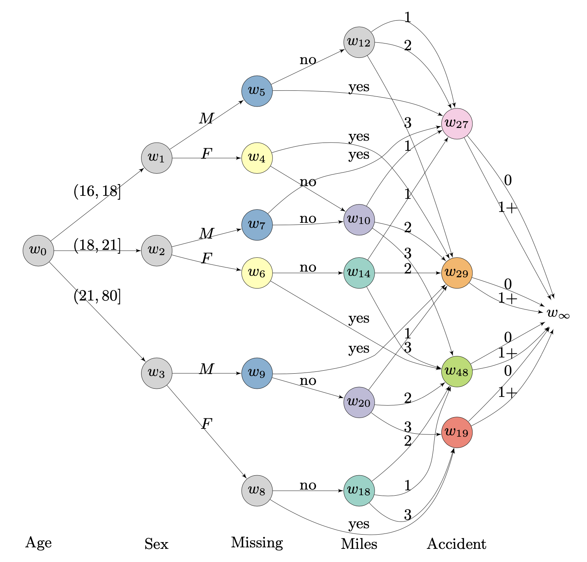

# Chain Event Graphs
[-ffa033.svg?style=flat-square)](https://www.r-project.org)
[](https://www.python.org)
[](https://opensource.org/licenses/MIT)

This repository contains my work on the Chain Event Graphs conducted under the Undergraduate Research Support Scheme at the University of Warwick.

Repository layout:

```
├── chain-event-graphs
│   ├── R
│   ├── python
│   ├── chain-event-graphs-report
|   ├── README.md
│   └── data
```

- `R` - contains the R scripts for data processing, EDA and the `stagedtrees` submodule with custom algorithms for stage partitioning
- `python` - contains the python scripts used for fitting the CEGs and generating the final graphs for the report
- `chain-event-graphs-report` - submodule with the final .tex report 
- `data` - contains raw data (content git ignored, data are safeguarded)


<p align="center">
  
</p>

